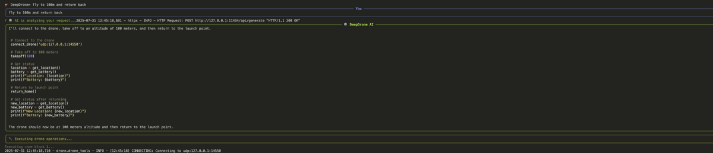

# 🚁 DeepDrone - AI-Powered Drone Control Terminal



**Control drones with natural language using AI models like OpenAI, Anthropic, Google, Meta, Mistral, and local Ollama models.**

## 🚀 Quick Start

```bash
# 1. Install dependencies
pip install -r requirements.txt

# 2. Start interactive setup
python main.py
```

The app will guide you through:
- **AI Provider Selection**: Choose from 6 providers (OpenAI, Anthropic, Google, Meta, Mistral, Ollama)
- **Model Selection**: Pick your AI model (local Ollama models auto-detected)
- **Drone Connection**: Connect to simulator or real drone
- **Natural Language Control**: "Take off to 30 meters", "Fly in a square pattern"

## ✨ Features

- 🤖 **Multi-AI Support**: Works with cloud and local AI models
- 🚁 **Real Drone Control**: DroneKit integration for actual flight control
- 💬 **Natural Language**: Control drones with conversational commands
- 🛠️ **Built-in Simulator**: Includes drone simulator for testing
- 🔒 **Safe Operations**: Emergency stops and return-to-home functions

## 🛠️ Simulator Setup

```bash
# Quick simulator (included)
python simulate_drone.py

# Advanced SITL (optional)
# Follow ArduPilot SITL installation guide
```

## 📝 Example Commands

```
🚁 DeepDrone> Connect to simulator and take off to 20 meters
🚁 DeepDrone> Fly to GPS coordinates 37.7749, -122.4194
🚁 DeepDrone> Execute a square flight pattern with 50m sides
🚁 DeepDrone> Return home and land safely
```

## 🔧 Requirements

- Python 3.8+
- DroneKit-Python
- LiteLLM for cloud models
- Ollama for local models (optional)

## 💻 Tech Stack

- **LiteLLM** - Unified interface for cloud AI models (OpenAI, Anthropic, Google, etc.)
- **Ollama** - Local AI model execution and management  
- **DroneKit-Python** - Real drone control and telemetry
- **Rich** - Beautiful terminal interface and formatting
- **Typer** - Command-line interface framework
- **Pydantic** - Configuration management and validation